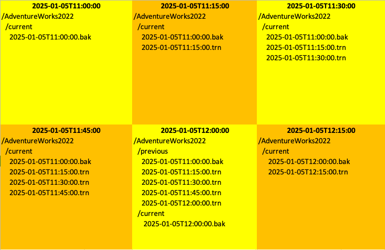
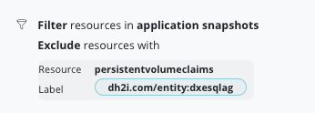
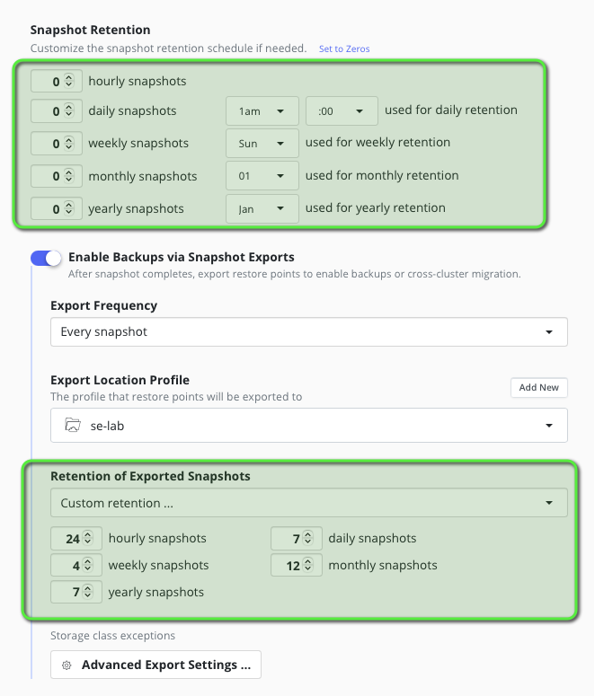
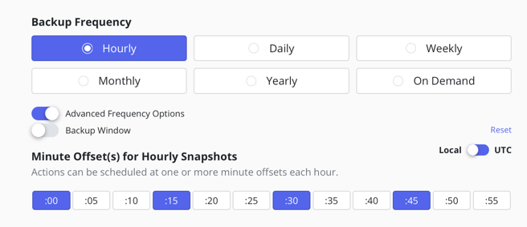

# Architecture Reference for using DH2I MSSQL with Kasten By Veeam

## Goal 

An architecture reference that explains how to use the DH2I MSSQL operator and Kasten by Veeam together.

DH2I operator creates MSSQL Availability group and listeners on kubernetes for High Availability and failover MSSQL database.

## Architecture card


| Description                                   | Values                           | Comment                   |
|-----------------------------------------------|----------------------------------|---------------------------|
| Database                                      | MSSQL                            | MSSQL with Availability group | 
| Database version tested                       | Microsoft SQL Server 2022 (RTM-CU16) (KB5048033) - 16.0.4165.4 (X64) <br> Nov  6 2024 19:24:49 Developer Edition (64-bit) on Linux (Ubuntu 22.04.5 LTS) <X64> | docker image tag : mcr.microsoft.com/mssql/server:latest |
| Operator vendor                               | [DH2I](https://dh2i.com)         | License required          |
| Operator vendor validation                    | In progress                      |                           |
| Operator version tested                       | docker.io/dh2i/dxoperator:1.0    |                           |
| High Availability                             | Yes                              | The database must be added to the Availability group see [install AdventureWorks2022 example](#lets-install-the-adventureworks2022-database-in-the-availability-group) <br> a failover test scenario is proposed |
| Unsafe backup & restore without pods errors   | Yes                              | See [unsafe backup and restore](#unsafe-backup-and-restore) section |
| PIT (Point In Time) supported                 | Yes                              | See the [limitation](#limitations) section for RPO consideration |
| Blueprint and BlueprintBinding example        | Yes                              | Only for database that belongs to the availability group, see the [limitation](#limitations) section |
| Blueprint actions                             | Backup & restore                 | Delete is done through restorepoint deletion as backup artifacts are living in a shared PVC |
| Backup performance impact on the database     | None                             | Backup is done on secondary replica which has no impact on the primary database |


# Limitations 

Make sure you understand the limitations of this architecture reference:

- PIT restore is only possible between 2 backups not after the last backup. Hence you still have a RPO that depends on the backup frequency.
- The Blueprint only backup and restore the database that are belonging to the availability group.


# Architecture diagrams

```
+---------------------------+       +---------------------------+       +---------------------------+
|                           |       |                           |       |                           |
|  SQL Server Instance 1    |       |  SQL Server Instance 2    |       |  SQL Server Instance 3    |
|  (Primary Replica)        |       |  (Secondary Replica)      |       |  (Secondary Replica)      |
|                           |       |                           |       |                           |
|  /var/opt/mssql           |       |  /var/opt/mssql           |       |  /var/opt/mssql           | 
|  (mssql-dxesqlag-0 pvc)   |       |  (mssql-dxesqlag-1 pvc)   |       |  (mssql-dxesqlag-2 pvc)   |
|  /etc/dh2i                |       |  /etc/dh2i                |       |  /etc/dh2i                |                             
|  (dxe-dxesqlag-0 pvc)     |       |  (dxe-dxesqlag-1 pvc)     |       |  (dxe-dxesqlag-2 pvc)     |
|  /backup                  |       |  /backup                  |       |  /backup                  |                              
|  (shared backup pvc)      |       |  (shared backup pvc)      |       |  (shared backup pvc)      |
+-------------+-------------+       +-------------+-------------+       +-------------+-------------+
              |                                   |                                   |           ^
              |                                   |                                   |           |
              +-----------------------------------+-----------------------------------+           |
                                                  |                                               |                                   
                                                  |                                               |                                   
                                                  v                                               |                                   
                                        +---------------------+                                   |
                                        | Availability Group  |                                   |
                                        +---------------------+                                   |
                                                  |                                               |
                                                  |                                               |
     +---------------------------+                v                            Backup databases   |  
     |    All PVCs in namespace  |      +---------------------+              on replica:/backup/  | 
     |                           |      |  Load Balancer      |                                   | 
     |  mssql-dxesqlag-0/1/2 pvc |      |  Listener 14033     |                                   |
     | dxe-dxesqlag-0/1/2 pvc    |      +---------------------+                                   |
     |    shared backup pvc      |                ^                                               |
     +---------------------------+                |                                               |
                    ^                             |                                               |
                    |                             | Restore databases                             |
Backup only bck PVC |                             | on primary:/backup/                           |
Restore only bck PVC|                             |                                               |
                    |                   +---------------------+                                   |
                    +-------------------|  Kasten K10         |-------------------+---------------+
                                        |  Backup & Restore   |
                                        +---------------------+
                                                  |
                                                  | export 
                                                  v
                                        +---------------------+
                                        |  S3 Storage         |
                                        |  (Backup Storage)   |
                                        +---------------------+
```

- The DH2I operator deploy a MSSQL cluster by creating a group of instance with an availability group. The operator will also create 2 PVCs per instance.
- We create a **single** shared pvc backup mounted on each instance on the path /backup
- When backup happens: 
   1. Kasten creates the backups of the databases on the backup PVC
   2. Kasten back up only the backup PVC that contains backup files (full backup and log backup)
- When restore happens
   1. Kasten restore only the backup PVC 
   2. Operator recreate the database PVCs 
   2. Kasten restore all the database from the backup pvc (executing the full plus all the log backup)

Here is how the backup folder will be at successive backup if the number of log backup before full backup is 4 and we do a backup every 15 minutes: 



# Install the operator

The steps are described in the [dh2i documentation](https://support.dh2i.com/dxoperator/guides/dxoperator-qsg/) :

```
wget https://dxoperator.dh2i.com/dxesqlag/files/v1-cu2.yaml
kubectl apply -f v1-cu2.yaml
```

# Create a  DxEnterpriseSqlAg mssql cluster with an availability group 

Create the namespace for your installation
```
kubectl create ns mssql
kubectl config set-context --current --namespace=mssql
```

Create license and sa secret replace the LICENSE with your license number.
```
kubectl create secret generic mssql --from-literal=MSSQL_SA_PASSWORD='MyP@SSw0rd1!'
kubectl create secret generic dxe --from-literal=DX_PASSKEY='MyP@SSw0rd1!' --from-literal=DX_LICENSE=WPFC-Z36O-BGSP-ERRH
```

Create a custom mssql.conf
```
cat <<EOF | kubectl create -f - 
apiVersion: v1
kind: ConfigMap
metadata:
    name: mssql-config    
data: 
    mssql.conf: |
     [EULA]
     accepteula = Y

     [network]
     tcpport = 1433

     [sqlagent]
     enabled = true
EOF
```

Create a shared pvc for the backup, this pvc must be Read Write many and must be snapshotable which is the case of azure file csi. 
I you don't have such storageclass available you can use [nfs-csi-driver](https://github.com/kubernetes-csi/csi-driver-nfs) based on a nfs share and which 
support volume snapshot. 
```
cat<<EOF | kubectl create -f -
apiVersion: v1
kind: PersistentVolumeClaim
metadata:
  name: backup  
spec:
  accessModes:
  - ReadWriteMany
  resources:
    requests:
      storage: 20Gi
  storageClassName: azurefile
EOF
```

Create the dx mssql cluster
```
cat<<EOF | kubectl create -f -
apiVersion: dh2i.com/v1
kind:  DxEnterpriseSqlAg
metadata:
  name: dxesqlag
spec:
  synchronousReplicas: 3
  asynchronousReplicas: 0
  # ConfigurationOnlyReplicas are only allowed with availabilityGroupClusterType set to EXTERNAL
  configurationOnlyReplicas: 0            
  availabilityGroupName: AG1
  # Listener port for the availability group (uncomment to apply)
  availabilityGroupListenerPort: 14033
  # For a contained availability group, add the option CONTAINED
  availabilityGroupOptions: null
  # Valid options are EXTERNAL (automatic failover) and NONE (no automatic failover)
  availabilityGroupClusterType: EXTERNAL
  createLoadBalancers: true
  template:
    metadata:
      labels:
        label: example
      annotations:
        annotation: example
    spec:
      dxEnterpriseContainer:
        image: "docker.io/dh2i/dxe:latest"
        imagePullPolicy: Always
        acceptEula: true
        clusterSecret: dxe
        vhostName: VHOST1
        joinExistingCluster: false
        # QoS – guaranteed (uncomment to apply)
        #resources:
          #limits:
            #memory: 1Gi
            #cpu: '1'
        # Configuration options for the required persistent volume claim for DxEnterprise
        volumeMounts:
        - mountPath: /backup
          name: backup
        volumeClaimConfiguration:
          storageClassName: managed-premium
          resources:
            requests:
              storage: 1Gi
      mssqlServerContainer:
        image: "mcr.microsoft.com/mssql/server:latest"
        imagePullPolicy: Always
        mssqlSecret: mssql
        acceptEula: true
        mssqlPID: Developer
        # Only set this to a value if you created a ConfigMap
        mssqlConfigMap: mssql-config
        # QoS – guaranteed (uncomment to apply)
        #resources:
          #limits:
            #memory: 2Gi
            #cpu: '2'
        # Configuration options for the required persistent volume claim for SQL Server
        volumeMounts:
        - mountPath: /backup
          name: backup
        volumeClaimConfiguration:
          storageClassName: managed-premium
          resources:
            requests:
              storage: 2Gi
      # Additional side-car containers, such as mssql-tools (uncomment to apply)
      containers:
      - name: mssql-tools
        image: "mcr.microsoft.com/mssql-tools"
        command: [ "/bin/sh" ]
        args: [ "-c", "tail -f /dev/null" ]
        volumeMounts:
        - mountPath: /backup
          name: backup
      volumes:
      - name: backup
        persistentVolumeClaim:
          claimName: backup
EOF
```

Create the load balancer
```
cat<<EOF | kubectl create -f -
apiVersion: v1
kind: Service
metadata:
  name: dxemssql-cluster-lb
spec:
  type: LoadBalancer
  selector:
    dh2i.com/entity: dxesqlag
  ports:
  - name: sql
    protocol: TCP
    port: 1433
    targetPort: 1433
  - name: listener
    protocol: TCP
    port: 14033
    targetPort: 14033
  - name: dxe
    protocol: TCP
    port: 7979
    targetPort: 7979
EOF
```

Wait for all pods to be ready and connect to the database from the first pod
```
kubectl exec -it dxesqlag-0 -c mssql-tools -- /opt/mssql-tools/bin/sqlcmd -S localhost -U sa -P 'MyP@SSw0rd1!'
```

> **Use Go after each sql command**: Each SQL command should be followed by a GO command to be executed for instance :
> ```
> SELECT name FROM sys.databases;
> GO
> ```

List the databases 
```
# list the databases
SELECT name FROM sys.databases;
```

Check availability group informations
```
# Basic Information about Availability Groups:
SELECT name, resource_id, resource_group_id, failure_condition_level, automated_backup_preference FROM sys.availability_groups;
# Information about Availability Replicas:
SELECT replica_server_name, availability_mode_desc, failover_mode_desc, primary_role_allow_connections_desc, secondary_role_allow_connections_desc FROM sys.availability_replicas;
# Information about Availability Databases 
SELECT database_name FROM sys.availability_databases_cluster;
# Information about Availability Group Listeners:
SELECT listener_id, dns_name, port  FROM sys.availability_group_listeners;
# find the current database
SELECT DB_NAME() AS CurrentDatabase;
# what are the availability groups 
SELECT name, automated_backup_preference_desc FROM sys.availability_groups;
```

You should see `AG1` which is consistent with the configuration of the DxEnterpriseSqlAg custom resource 
```
name  automated_backup_preference_desc                            
---------------------------------------
 AG1  secondary 
```


Now you can exit by simply typing exit 
```
exit
```

# Create an alias to connect to the listener 

For simplicity let's create an alias that will connect to the listener through the first pod.

```
alias dx="kubectl exec dxesqlag-0 -c mssql-tools -it -- /opt/mssql-tools/bin/sqlcmd -S dxemssql-cluster-lb,14033 -U sa -P 'MyP@SSw0rd1\!'"
```

Notice the Host : `-S dxemssql-cluster-lb,14033` which is the name of the listener service.

The only thing you have to do now is to simply type `dx`
```
dx
1>
```

When you connect to the listener host you actually connect to the primary. Therefore a 
simple way to know who's the primary is to execute `select @@servername` 

If it's you first install you most likely get `dxesqlag-0`, but after the fail over scenario you could
have `dxesqlag-1` or `dxesqlag-2`

# Let's install the AdventureWorks2022 database in the availability group

first find who's the primary, because adding a database to the availability group require to be on the primary.
```
select @@servername
```
The listener always connect to the primary, hence `@@servername` will give you the primary.

Suppose you find `dxesqlag-0`

Let's install the AdventureWorks2022 database by executing command from the mssql-tools container
```
kubectl exec -it dxesqlag-0 -c mssql-tools -- /bin/bash
```

Let's download the backup on the shared backup pvc : 
```
curl -L -o /backup/AdventureWorks2022.bak https://github.com/Microsoft/sql-server-samples/releases/download/adventureworks/AdventureWorks2022.bak
sqlcmd -S localhost -U sa -P 'MyP@SSw0rd1!'
```

Discover the logical file name of the database 
```
RESTORE FILELISTONLY FROM DISK = '/backup/AdventureWorks2022.bak';
```
The 2 logical files we find from the output is AdventureWorks2022 and AdventureWorks2022_log

Now you can restore the database using this 2 virtual filename.
```
RESTORE DATABASE AdventureWorks2022 FROM DISK = '/backup/AdventureWorks2022.bak' WITH MOVE 'AdventureWorks2022' TO '/var/opt/mssql/data/AdventureWorks2022.mdf', MOVE 'AdventureWorks2022_log' TO '/var/opt/mssql/data/AdventureWorks2022.ldf', RECOVERY;
```

You should obtain an output like this one 
```
Processed 25376 pages for database 'AdventureWorks2022', file 'AdventureWorks2022' on file 1.
Processed 2 pages for database 'AdventureWorks2022', file 'AdventureWorks2022_log' on file 1.
RESTORE DATABASE successfully processed 25378 pages in 10.375 seconds (19.109 MB/sec).
```

You can list the tables of AdventureWorks 
```
USE AdventureWorks2022;
SELECT TABLE_SCHEMA, TABLE_NAME FROM INFORMATION_SCHEMA.TABLES WHERE TABLE_TYPE = 'BASE TABLE';
SELECT COUNT(*) FROM Person.Person;
```


In order to add the AdventureWorks2022 database in the availabilty group you need to swithc first in full recovery mode and take a backup. 

```
ALTER DATABASE AdventureWorks2022 SET RECOVERY FULL;
BACKUP DATABASE AdventureWorks2022 TO DISK = '/backup/AdventureWorks2022.bak';
BACKUP LOG AdventureWorks2022 TO DISK = '/backup/AdventureWorks2022.trn';
```

Now we can add the database to the availability group 
```
use master;
ALTER AVAILABILITY GROUP AG1 ADD DATABASE AdventureWorks2022;
```

Now you can check that the database has been replicated on every nodes.
Exit from the sqlcmd and the container and execute: 
```
kubectl exec dxesqlag-1 -c mssql -- ls /var/opt/mssql/data/AdventureWorks2022.mdf
kubectl exec dxesqlag-2 -c mssql -- ls /var/opt/mssql/data/AdventureWorks2022.mdf
```

# Test failover 

In order to test failover we create a client that connect with the availability listener and constantly execute 
```
SELECT COUNT(*) FROM Person.Person;
```

Let's create the client and exec bash on it 
```
kubectl run client --rm --image mcr.microsoft.com/mssql-tools -it -- /bin/bash
```

Now you can test this command using the listener `dxemssql-cluster-lb,14033`
```
sqlcmd -S dxemssql-cluster-lb,14033 -U sa -P 'MyP@SSw0rd1!' -d AdventureWorks2022 -Q 'SELECT COUNT(*) FROM Person.Person;'
```

If this command is successful let's do it in a loop
```
while true
do
  sqlcmd -S dxemssql-cluster-lb,14033 -U sa -P 'MyP@SSw0rd1!' -d AdventureWorks2022 -Q 'SELECT COUNT(*) FROM Person.Person;'
  sleep 1
done
```  

and in another shell kill the first pod 
```
kubectl delete po dxesqlag-0
```

You'll see this ouput in the client pod
```
-----------
      19972

(1 rows affected)
           
-----------
      19972

(1 rows affected)


Sqlcmd: Error: Microsoft ODBC Driver 13 for SQL Server : Unable to access availability database 'AdventureWorks2022' because the database replica is not in the PRIMARY or SECONDARY role. Connections to an availability database is permitted only when the database replica is in the PRIMARY or SECONDARY role. Try the operation again later..
Sqlcmd: Error: Microsoft ODBC Driver 13 for SQL Server : TCP Provider: Error code 0x2749.
Sqlcmd: Error: Microsoft ODBC Driver 13 for SQL Server : A network-related or instance-specific error has occurred while establishing a connection to SQL Server. Server is not found or not accessible. Check if instance name is correct and if SQL Server is configured to allow remote connections. For more information see SQL Server Books Online..
Sqlcmd: Error: Microsoft ODBC Driver 13 for SQL Server : Unable to access availability database 'AdventureWorks2022' because the database replica is not in the PRIMARY or SECONDARY role. Connections to an availability database is permitted only when the database replica is in the PRIMARY or SECONDARY role. Try the operation again later..
           
-----------
      19972

(1 rows affected)

           
-----------
      19972

(1 rows affected)
```

As you can see the database was unavailable for just few seconds and then the listener fail over another replica that became  the primary.
It is also possible that you don't even see the error message above if the fail over was done within the 1 second sleep.

Let's find who's the primary now, use dx to connect to the listener and execute  
```
select @@servername
```

You should get `dxesqlag-1`or `dxesqlag-2`


# Unsafe backup and restore

An Unsafe backup and restore consist of capturing the namespace that contains the database without any extended behaviour 
from Kasten (freeze/flush or logical dump) by just backing up using the standard Kasten workflow. Then restore it to see if database : 
1. Restarts and can accept new read/write connections 
2. Is in a state consistent with the state of the database at the backup but this is very difficult to check 

## Should I rely on unsafe backup and restore ?

Short answer : No !!

Long answer : Database are designed to restart after a crash and Kasten take crash consistent backup. Hence the quality of your 
restore will be similar to a restart after a crash.

**With unsafe backup and restore your workload may restart but silent data loss can occur with no error message to let you know.**

## So what's the point with unsafe backup and restore ? 

If you don't have the time to implement a blueprint for your database, unsafe backup and restore is always better than nothing ... 
Actually it's far better than nothing. But your backup may be dirty and you'll see it just after a restoration. It's why later we will use 
our extension mechanism (blueprint) to take proper backups.

## Testing Unsafe backup and restore 

Let's add a table to the AdventureWorks2022 database. 
```
use AdventureWorks2022;
CREATE TABLE Sales.MyTable (ID INT IDENTITY(1,1) PRIMARY KEY, Name NVARCHAR(50),CreatedAt DATETIME DEFAULT GETDATE());
INSERT INTO Sales.MyTable (Name) VALUES ('John Doe');
select * from Sales.MyTable;
```

Now use Kasten to create a backup + export policy for the namespace mssql. 

When the backup is finished delete namespace mssql
```
kubectl delete ns mssql
```

Then go to the remote restore point and simply click restore. 

The restore should be successful and you should be able to retreive the data you just created.

> **Note:** We are using the remote the restore point instead of the local restore point because when we deleted the namespace we 
> deleted also the volumesnapshots that are attached to this namespace. If you want to test the restore of a local restore point do not 
> delete the mssql namespace but simply delete the DxEnterpriseSqlAg custom resource and all the pvc 
> ```
> kubectl delete DxEnterpriseSqlAg --all -n mssql
> kubectl delete pvc --all -n mssql
> ```
> then click restore on the local restore point. The restore should take less time because you 
> restore from local snapshot.


# Use a Kasten blueprint to take full and log backup

The unsafe backup and restore we did above worked well because the database was not under heavy use. 
But on production SQL Server keeps active transactions and uncommitted data in memory. 
A snapshot taken without coordinating with SQL Server might lead to an inconsistent state. 

This is the objective of [T-SQL snapshot](https://learn.microsoft.com/en-us/sql/relational-databases/backup-restore/create-a-transact-sql-snapshot-backup?view=sql-server-ver16). However this is not the path we are taking here for three reasons :
- this feature is only available on MSSQL server 2022 
- We could not find clear documentation about handling Availability group with T-SQL Snapshot (should we do the snapshot on the primary or read instance and if so what is the process for restoring)
- There is a strong need for PIT restore and this kind of backup does not support PIT 

To guarantee consistency of our backup we're going to use a combination of  `BACKUP DATABASE` and 
`BACKUP LOG` command to support PIT with the ability to run multiple log backup before doing a full backup.

## Full and Log backup sequence

The number of log backups before doing a full backup is controlled by an annotation on the DxEnterpriseSqlAg custom resources.
The blueprint also track the number of log backup already done by updating the annotation 

```
metadata:
  ...
  annotations:
    kasten.io/numLogBackupsBeforeFullBackup: 4
    kasten.io/counterLogBackups: 0
```

You can setup and even change the value of `kasten.io/numLogBackupsBeforeFullBackup` when creating the object DxEnterpriseSqlAg or 
when installing the blueprint but you should not change or setup the value of `kasten.io/counterLogBackups` because this annotation is managed by the blueprint.

## Let's work on a frequency instance to better understand 

Let's assume you want to take a full backup every hour and do a log backup every 15 minutes. This is a common backup strategy with mssql backup.

The solution is to create a kasten hourly policy with a subfrequency every 15 minutes and setup numLogBackupsBeforeFullBackup to 4.

After 1 full backup and 4 logs backup, 1 hour has passed we take a new full backup.

## Folder organisation and backup workflow 

### Overview
We organize the backup workflow around 2 folders `current` and `previous`. The full and log backups are always performed in the `current`
directory but when we perform a new full backup `current` is renamed to `previous` and we recreate the `current` directory. In the subsequent 
backup `previous` directory will be removed (but `previous` continues to exist in the restore point that was performing a new full backup).


To better understand this organisation of the restore point let's assume want to take a full backup every hour and a log backup every 15 minutes.

For doing that we'll setup an hourly policy with a 15 minutes subfrequency we also setup `numLogBackupsBeforeFullBackup`to 4. 

Now here is how the restore point will look : 


* If you want to restore at 2025-01-05T11:22:00 then you'll use the 2025-01-05T11:30:00 restore point 
* If you want to restore at 2025-01-05T12:06:00 then you'll use the 2025-01-05T12:15:00 restore point 
* But if you want to restore at 2025-01-05T11:52:00 you'll use the previous directory of the 2025-01-05T12:00:00 restore point 


The impact on the target backup location profile is limited because kopia (the datamover) is fully incremental and won't upload files that already exist in the repository. 

By keeping only the full backup and the subsequent logs backups we avoid the backup pvc to grow indefinitely.
The backup pvc capacity must be at least 3 times the size of all the full backup of each databases. 

We said at least 3 times because we must handle the `previous` full backup and its chain of logs backup plus the new `current` full backup. 

But if there is a lot of changes then the total logs backup can be bigger than the full log backup and you should allocate more than 3 times.


### If I just want to restore the restorepoint

If you just want to restore the restorepoint then you just click restore and the blueprint will restore using full backup and the subsequent log backup that 
he will find in the `current` directory. 

### Algorithm breakdown for backup

If you need to change the blueprint here is a quick explaination of the algorithm : 

0. If `counterLogBackups` annotation does not exist then set it up to 0, if `numLogBackupsBeforeFullBackup` annotation does not exist then set it up to 24.
This behaviour is for the default hourly policy, it will create a full backup every day and an hourly log backup (but later we will show other configurations).

1. Remove any database folder that are not anymore in the availability group

2. If a `previous` directory exist remove it

3. If `counterLogBackups` is greater than 0 we create a new log backup in `current` (or a full backup if no full backup already exist) and increment `counterLogBackups` 

4. if `counterLogBackups` equals `numLogBackupsBeforeFullBackup` we rename `current` to `previous` and set `counterLogBackups` to 0

5. if `counterLogBackups` equals 0 we create an empty `current` directory, do a full backup in `current` and set `counterLogBackups` to 1


This sequence of actions is executed before kasten capture the backup pvc and is applied on each database folder. 


# Performance and storage consideration

We alway take the backup on a read replica and not on the primary instance to not impact 
the performance of the applications that are using this database. Beside most of the time we 
take log backup which require less resource than a full backup.

Also if you want to reduce the size of storage taken for the backup you can exclude the workload pvc by just adding a label exclude filter 



```
        filters:
          excludeResources:
            - resource: persistentvolumeclaims
              matchExpressions:
                - key: dh2i.com/entity
                  operator: In
                  values:
                    - dxesqlag
```

We don't need them anymore because we restore from the full and log backups that we created in the backup pvc. 

You can also reduce the local retention of the backup pvc to zero and you will only restore from the remote restorepoint.



# A classic 15 Minutes RPO scenario 

Imagine you want to reach 15 minutes RPO, doing a full backup very 15 minutes would not work because it would 
take too many times and too many storage to do a full backup every 15 minutes. But you can implement this scenario : 
- A log backup every 15 inutes
- A full backup every day 

For this create an Hourly policy with a sufrequency every 15 minutes



```
  frequency: "@hourly"
  subFrequency:
    minutes:
      - 0
      - 15
      - 30
      - 45
    hours:
      - 0
    weekdays:
      - 0
    days:
      - 1
    months:
      - 1
```

And set up `numLogBackupsBeforeFullBackup` to 96.

Every 96*15 minutes = 24 hours a full backup will happen while a log backup is executed every quater.

# Restoring the database at a specific restorepoint

If you follow the [deployment recommandation](#deployment-and-resource-consideration-for-backup) you have created the database in a dedicated namespace. 

Delete the namespace.

Now select the desired restore point and click restore. 

# Restoring the database at a specific point in time (PIT)

If you follow the [deployment recommandation](#deployment-and-resource-consideration-for-backup) you have created the database in a dedicated namespace. 

You delete it and recreate it with the same name. In this new empty namespace create a configmap pit-restore where you specify the PIT in UTC time. 

```
kubectl create configmap pit-restore --from-literal=date='2025-02-12T04:32:12' 
```

> **Important** the time used here is UTC. Do not forget to translate the desired time to UTC.
> For instance if you're time is UTC+3 and you want to restore at 2025-02-12T07:32:12 you will look for the 
> 7:45 restorepoint in the Kasten Dashboard (because the Kasten dashboard is always aligned to your timezone)
> 
> but inside this restorepoint the last log backup is actually 4:45 (7-3=4) so you will create the configmap accordingly 
> ```
> kubectl create configmap pit-restore --from-literal=date='2025-02-12T04:32:12'
> ``` 


To lauch the PIT restore just click restore.


## What happens in the blueprint 

this is what the blueprint do during restore.

```
use master;
ALTER AVAILABILITY GROUP AG1 REMOVE DATABASE AdventureWorks2022;
RESTORE DATABASE AdventureWorks2022 FROM DISK = '/backup/current/AdventureWorks2022-2025-01-05T11:00:00.bak' WITH NORECOVERY, REPLACE;
RESTORE LOG AdventureWorks2022 FROM DISK = '/backup/current/AdventureWorks2022-2025-01-05T11:15:00.trn' WITH NORECOVERY, REPLACE;
RESTORE LOG AdventureWorks2022 FROM DISK = '/backup/current/AdventureWorks2022-2025-01-05T11:30:00.trn' WITH NORECOVERY, REPLACE;
RESTORE LOG AdventureWorks2022 FROM DISK = '/backup/current/AdventureWorks2022-2025-01-05T11:45:00.trn' WITH NORECOVERY, STOPAT = '2025-01-05T11:32:00';
RESTORE DATABASE AdventureWorks2022 WITH RECOVERY;
ALTER AVAILABILITY GROUP AG1 ADD DATABASE AdventureWorks2022;
```

# Create the blueprint

## Important 

We provide an example blueprint implementing the strategy described above but the customer or the customer's
partner must adapt this strategy to its unique use case. It is very important to run extensive test of backup
and restore before moving to production.


## Install

```
kubectl create -f mssql-bp.yaml
kubectl create -f mssql-bp-binding.yaml
```

The binding ensure that any time Kasten will backup a DxEnterpriseSqlAg object it will apply the blueprint.

> **Important:** Now that the blueprint is handling the backup of the databases you only need to backup 
> the `backup` PVC and you can avoid the other PVC (created by the operator). A simple way for doing 
> that is to use in your policy an exclude filter on the PVC with the label `dh2i.com/entity:dxesqlag`.
> with this filter only the `backup` PVC will be protected and restored, the other PVC will be recreated 
> automatically by the operator.


## Test PIT (Point In Time) restore

### Create a client that insert data every 10 seconds 
For testing we are going to insert every 10 seconds a new entry in the `Sales.MyTable` table

Create the pod inserter 
```
kubectl create -f inserter.yaml 
```

if you logs the inserter pod 
```
kubectl logs inserter 
```

You should have an ouput like this one
```
+ true
+ /opt/mssql-tools/bin/sqlcmd -S dxemssql-cluster-lb,14033 -U sa -P 'MyP@SSw0rd1!' -d AdventureWorks2022 -Q 'INSERT INTO Sales.MyTable (Name) VALUES ('\''John Doe'\'');'

(1 rows affected)
+ sleep 10
+ true
+ /opt/mssql-tools/bin/sqlcmd -S dxemssql-cluster-lb,14033 -U sa -P 'MyP@SSw0rd1!' -d AdventureWorks2022 -Q 'INSERT INTO Sales.MyTable (Name) VALUES ('\''John Doe'\'');'

(1 rows affected)
+ sleep 1
+ true
+ /opt/mssql-tools/bin/sqlcmd -S dxemssql-cluster-lb,14033 -U sa -P 'MyP@SSw0rd1!' -d AdventureWorks2022 -Q 'INSERT INTO Sales.MyTable (Name) VALUES ('\''John Doe'\'');'
```

# Deployment and resource consideration for backup

> **About general consideration for MSSQL server** : How you configure resource 
> (CPU, RAM, Network and storage) for running MSQL with availibility group is 
> beyond the scope of this guide. DH2I has an expertise in this field and can 
> advise you. In this guide we only consider the backup and resource use case 
> not the "current" run.

## We advise to deploy the database DxEnterpriseSqlAg custom resource in its dedicated namespace

It's possible to deploy 2 DxEnterpriseSqlAg custom resources  in the same namespace but if you need to 
restore them at different moment you'll have to be more carefull when picking up 
elements in the granular restore. Deleting the namespace and restoring it by just clicking
restore is very convenient. After all that's the role of a namespace : avoid name collision.

By using a dedicated namespace you'll be able to apply more easily node selector and 
resource quota which is often necessary for databases. 

When you back up an MSSQL database using the BACKUP DATABASE command, the primary resource 
considerations involve disk I/O, network throughput, and temporary storage, rather than CPU 
or RAM. 

## Disk

- Backups are disk-intensive operations because the database engine reads data from the source 
storage and writes it to the backup destination.
- Ensure your backup destination (e.g., local disk, SAN, or network share) has high I/O capacity 
to handle the workload without becoming a bottleneck.
- Use fast storage such as SSDs for the backup destination if possible.

## Network Throughput

- If you are backing up to a remote location (e.g., a network share or cloud storage), network 
bandwidth is crucial.
- Slow network speeds can significantly increase the backup duration.

## Temporary Storage (for Compression/Encryption):

- If you use backup compression or encryption, MSSQL may need additional temporary storage for 
intermediate data. Plan for extra disk space on the server where the backup is executed.

# Migration 

You can migrate your database with a regular Kasten migration workflow. You only need to ensure 
that prior to the migration : 
- the operator is installed as described in the section [Install the operator](#install-the-operator).
- the blueprint and blueprintbinding are recreated as described in [](#)


# Common troubleshooting and repair

Sometime after several fail some of the participant may not be in a healthy state.

You can discover this with this command : 

```
select  * from  sys.dm_hadr_availability_replica_states;
```

We get this output (we removed some of the columns)
```
9BFF...A-8B7D2C28AFDB        0    2 SECONDARY   NULL   CONNECTED   NULL    NOT_HEALTHY 
5655...A-8B7D2C28AFDB        0    2 SECONDARY   NULL   CONNECTED   NULL    NOT_HEALTHY 
DDA0...A-8B7D2C28AFDB        1    1 PRIMARY     ONLINE CONNECTED   ONLINE  HEALTHY     
```

It shows that only the last pod was healthy. 
You may have to investigate further to check why the pods are unhealthy.

In our case the simple thing we had to do was deleting the unhealthy pod and the operator
recreate them and they were healthy. 

# Conclusion 

Building an enterprise blueprint is always a tradeoff where yous final choices will be directed by your 
specific conditions. 

With this enterprise blueprint we get the following : 
- High availability for MSSQL database with fail over 
- Backup on secondary to avoid performance impact on application during backup
- Full restore automation with Kasten 
- Manual PIT restore after a full restore

But we don't get backup based on storage snapshot because support for T-SQL snapshot with Availibilty Group 
still need to be clarified. However you can restore the `backup` PVC from a snapshot which is avoiding 
downloading it from a backup location (S3, Azure blob container ...) and that will speed up your restore
process.